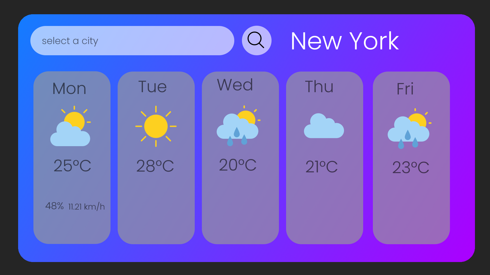

# Funkcionális specifikáció

### Áttekintés

A Weather app egy olyan alkalmazás, amely lehetővé teszi a felhasználók számára, hogy könnyen és gyorsan hozzáférjenek
az időjárási információkhoz. Az alkalmazás kártyákon jeleníti meg az időjárási adatokat, amelyek közül az első kártyán
az aktuális hőmérséklet kap kiemelt szerepet. A további négy kártya grafikus formában mutatja be az előrejelzéseket a
következő napokra, segítve a felhasználókat a jövőbeli időjárás feltételeinek jobb megértésében.

Az alkalmazás felhasználóbarát és könnyen használható, és a felhasználók bármely platformon, legyen az számítógép,
tablet vagy telefon, gyorsan megtalálják a kívánt helyszín időjárását. Az ingyenes elérhetőség lehetővé teszi bárki
számára, hogy naprakész időjárási adatokhoz jusson. Az alkalmazás a funkcionalitásra és a felhasználói élményre
összpontosít, hogy egyszerűsítse az időjárásinformációk elérését és használatát.

### Jelenlegi helyzet leírása
Rohanó információéhes világunk óhatatlanul vágyik arra, hogy a környező történésekről mindent - és ezalatt értsd:
MINDENT - tudnia kell a benne élő embereknek.

A mi alkalmazásunk ebben segít és szükséges információkat közöl az
egyénnek, melyek nélkülözhetetlenek ahhoz, hogy ki tudja tenni a lábát a házból úgy, hogy soha nem érik meglepetések, ha
időjárásról van szó. Megannyi baleset történik a világban az időjárás miatt, hiszen az anyatermészetet nem tudjuk
becsapni, de tudunk hozzá alkalmazkodni. Évente többezren halnak meg egy egyszerű megfázásban, ezt pedig nem
megengedhető. Ha egy vastagabb kabát választ el az életünk megszűnésétől, akkor inkább válasszuk a kabátot, mintsem a
halált. Tehát az alkalmazásunk nem más mint egy időjárás monitoring alkalmazás.

Különböző városok időjárásának megfigyelésére alkalmas. Jelen és jövőbeli időjárás megfigyelése. Az időjárásmegjelenítés
tartalmazza a hőmérséklet, szél és egyéb időjárással kapcsolatos státusz megosztását / megjelenítését. Csak meg kell
nyitnia alkalmazásunkat, beírni az Ön városát és máris öltözködhet az igényei szerint!

Számos forrásból tudunk tájékozódni az időjárásról. Többek között a TV-ből, az alapértelmezett vagy az általunk
letöltött telefonos applikációnkon vagy esetleg webes böngészőn keresztül. A felsorolt források különböző naprakész
adatokból dolgoznak, de szinte mindegyikükben közös, hogy figyelemelterelő reklámok, egyértelmű hátrányok, vagy havi
feliratkozói díjazás csökkentik a felhasználói élményt.

### Követelménylista
- Kártya jellegű megjelenítés, ahol a mai és a következő 4 nap előre látható / jelenlegi időjárása megjelenik
- A kártyák tartalmazzanak egy napocskát, amennyiben az idő napos, valamint egy felhőt, amennyiben felhős
- Ezen felül, amennyiben az idő esős, a felhőcskékből láthatóan csepegjenek esőcseppek
- ...amennyiben borús, fekete legyen a felhő
- Az égen látható információ egy fehér karikában jelenjen meg
- A kártyák tartalmazzák továbbá az adott napot, melyre megjelenik az időjárás a fehér karika alatt
- Mindezek alatt, a kártya alján jelenjen meg a páratartalom százalékosan valamint a széljárás ereje

### A rendszer céljai és nem céljai
- Egy olyan felület létrehozása, amely intuitívan kezelhető
- Órákra bontott információ az aznapi hőmérsékletekről
- Jelenlegi szélerősség a felhasználó által választott településeken

Nem céljai:
- Hosszú távú előrejelzés
- Műholdas hőtérkép a hideg és meleg frontokról
- Óceáni áramlatok műholdas térképen való ábrázolása

### Vágyálomrendszer leírása
Ingyenes weboldalunk célja, hogy ügyfeleink átlátható, naprakész, percre pontos információhoz jussanak, hogy ne érhessék
meglepetések utazás, kirándulás esetében. Tudják, mikor hogyan kell öltözködniük és mit kell magukkal vinniük
az utazásokra. Az alkalmazásnak könnyen üzemeltethetőnek kell lennie. Az online megjelenítésnek lehetőleg reszponzívnak
kell lennie, hogy mobil / tablet illetve számítógép eszközökön is szépen, jól láthatóan megjelenített legyen.
Az ügyfélnek négy következő napon kívül a mai napnak is láthatónak kell lennie, hogy milyen időjárásra kell számítani. Elvárt a
platformfüggetlenség, nem elfogadható, ha csak egy operációs rendszeren futtatható az alkalmazás.

### Jelenlegi üzleti folyamatok leírása

### Igényelt üzleti folyamatok leírása
- Reklámmentesen és bejelentkezés nélkül hozzáfér a felhasználó a kívánt információhoz
- Az ügyfél manuálisan megadja helyadatait vagy az eszköz helyadatait felhasználva automatikusan beállítja a rendszer
- Internet elérés esetén lekéri a napi előrejelzést a beállított helyszínekre, ami magába foglalja az órákra bontott hőmérsékletet, az idő természetét, pl: felhős, napos, esős
- Az alkalmazás kártyákra bontva megjeleníti a mai illetve a következő négy nap előrelátható időjárását
- A kártyák tartalmazzák az időjárás intuitív megjelenítését, a hőmérsékletet, a széljárást és a páratartalmat
- A kártyák fölött elhelyezkedik egy keresősor, mely mellett a nagyító gombra kattintva elindul a funkcionalitás

### Forgatókönyv
1. Az alkalmazást a felhasználó megnyitja, majd rögtön elé tárul a felület, mely tartalmaz egy keresősort,
egy nagyító gombot, mellyel az intuíciója sugallata szerint az lesz a "Keresés" gomb, melyre rá kell
nyomnia, hogy az előtte lévő keresősorba beírt adatot fel tudja dolgozni az alkalmazás. Az egész lila-kék alapú
háttéren helyezkedik el, hogy hangsúlyozza a hideg színeket.
2. Következő lépésként a felhasználó beír egy városnevet a keresőbe.
3. A felhasználó lenyomja az entert, vagy rányom a nagyító gombra, ezáltal beküldi a beadott adatokat.
4. A front-end validátorok segítségével meghatározza, hogy az input megfelelő-e.
Amennyiben megfelelő, továbbküldi a back-endnek (API), mely feldolgozza az adatot, elvégzi
a szükséges műveleteket az adattal és visszaküldi a front-end részére, továbbértékelés céljából a már
front-end részére is értelmezhető és felhasználó számára továbbítható adatokat.
5. A felhasználó előtt elsősorban megjelenik az általa beírt település neve
6. Ezt követően egyesével megjelennek szépen lassan a jelenlegi nap, valamint a négy következő nap
időjárásjelentései.

### Fogalomszótár
- ***Kártya:*** kártyaszerű megjelenítése az alkalmazáson belül megjelenő napoknak
- ***Front-end:*** amit a weboldalon látni lehet: funkciók, dizájnelemek, felépítés
- ***Back-end:*** amit nem látni, azonban a fő számításokat végzi az alkalmazásban, egy jelentős része
megfeleltethető az API betűhármasnak
- ***API:*** _„Application Programming Interface”_ avagy egy szervíz, mely összeköt két alkalmazást

### Képernyőtervek
