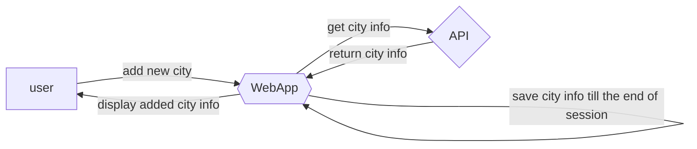

# Időjárás alkalmazás követelmény specifikáció

### Jelenlegi státusz:
Rohanó információéhes világunk óhatatlanul vágyik arra, hogy a környező történésekről mindent - és ezalatt értsd:
MINDENT - tudnia kell a benne élő embereknek. A mi alkalmazásunk ebben segít és szükséges információkat közöl az
egyénnek, melyek nélkülözhetetlenek ahhoz, hogy ki tudja tenni a lábát a házból úgy, hogy soha nem érik meglepetések, ha
időjárásról van szó. Megannyi baleset történik a világban az időjárás miatt, hiszen az anyatermészetet nem tudjuk
becsapni, de tudunk hozzá alkalmazkodni. Évente többezren halnak meg egy egyszerű megfázásban, ezt pedig nem
megengedhető. Ha egy vastagabb kabát választ el az életünk megszűnésétől, akkor inkább válasszuk a kabátot, mintsem a
halált. Tehát az alkalmazásunk nem más mint egy időjárás monitoring alkalmazás. Különböző városok időjárásának
megfigyelésére alkalmas. Jelen és jövőbeli időjárás megfigyelése. Az időjárásmegjelenítés tartalmazza a hőmérséklet,
szél és egyéb időjárással kapcsolatos státusz megosztását / megjelenítését. Csak meg kell nyitnia alkalmazásunkat,
beírni az Ön városát és máris öltözködhet az igényei szerint!

### Vágyálom rendszer:
Célunk ügyfeleink naprakész, percre pontos információk szerzése a jelenlegi időjárásról annak céljából, hogy ne érhessék
meglepetések utazás, kirándulás esetében, hogy tudják, mikor hogyan kell öltözködniük és mit kell magukkal vinniük az
utazásokra. Az alkalmazásnak könnyen üzemeltethetőnek kell lennie. Az online megjelenítésnek lehetőleg reszponzívnak
kell lennie, hogy mobil / tablet illetve számítógép eszközökön is szépen, jól láthatóan megjelenített legyen. Elvárt a
platformfüggetlenség, nem elfogadható, ha csak egy operációs rendszeren futtatható az alkalmazás.

### Jelenlegi üzleti folyamatok:

#### App indítása:
A felhasználó elé táruljon egy szép, igényes felület, melyen lehetősége van beírni az általa választott várost illetve
települést.
#### Widgetek:
A felhasználó egy különböző elemekből felépített felületet lásson, melyen dinamikusan megjelenik az aktuális település
időjárása.
#### Szükséges időjárásadatok közlése:
Az alkalmazás tartalmazza az időjárásolvasáshoz szükséges összes adatot például: hőmérséklet, település neve, százalékos 
páratartalom valamint a szél sebessége
#### Felhasználói interakciók feldolgozásáért felelős információinput
Szükséges az alkalmazásnak tartalmaznia egy keresősávot, valamint a keresősávhoz egy megfelelő "Keresés" gombot.
#### Információbecslés, avagy "Könnyített Mód"
Az információ feldolgozását meg kell próbálni megtippelni, amennyiben a felhasználó félreírja a számára igényelt
település megnevezését!
#### A keresőgomb működése
A keresésgomb lenyomásakor az alkalmazás kiírja a felületre a fent említett adatokat.

### Követelménylista:

| **ID** | **Név** | **Kifejtés** |
|--------|---------|--------------|
| K1 | Felhasználói interfész | Az alkalmazásnak egy felhasználóbarát felülettel kell rendelkeznie. |
| K2 | Helyszínválasztás      | A helyszínválasztásnak lehetővé kell tennie a felhasználók számára, hogy kereső opció segítségével gyorsan megtalálhassák a választott helyszínt/várost. |
| K3 | Időjárásinformációk    | Az időjárásinformációknak pontosnak és naprakésznek kell lenniük, hogy a felhasználók megbízható adatokhoz jussanak. |
| K4 | Aktuális hőmérséklet   | Az aktuális hőmérsékletnek kiemelten kell megjelennie. |
| K5 | Előrejelzés            | Az előrejelzésnek öt napos időtávot kell lefednie és grafikus formában kell bemutatnia az időjárás változásait. |
| K6 | Mobilkompatibilitás    | A reszponzív designnak biztosítania kell, hogy az alkalmazás megfelelően műdjön mobiltelefonokon és tableteken is. |
| K7 | Adatforrás             | Az időjárásinformációk lekérdezését egy külső weather API használatával kell megvalósítani. |

---