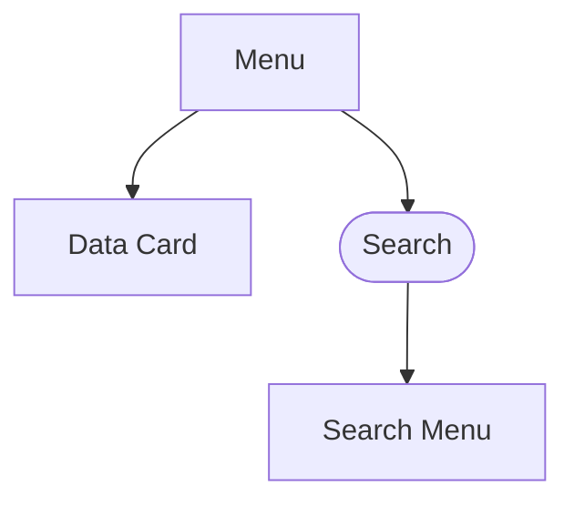
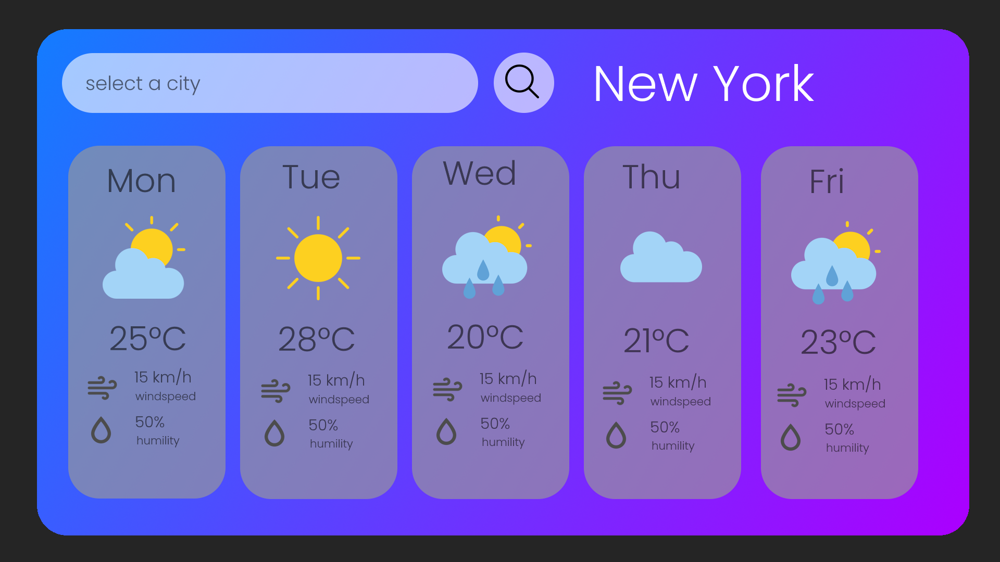

# Rendszerterv

## A rendszer célja

A rendszer célja aktuális regionális időjárási adatok hozzáférésének biztosítása.
A felhasználónak lehetőséget ad bizonyos települések időjárási adatainak elmentésére.
A Weather webapplikáció célja az, hogy a felhasználók számára könnyen és gyorsan hozzáférhetővé tegye az időjárási információkat.

A webalkalmazás lehetővé teszi a felhasználók számára, hogy egyszerűen megkeressék a kívánt helyszínt a kereső funkció használatával, és biztosítja az időjárási adatok megjelenítését kártyák formájában.
Az első kártya kiemelt módon mutatja be az aktuális hőmérsékletet, míg a további kártya grafikusan ábrázolja a négy napos előrejelzést, segítve a felhasználókat a jövőbeli időjárás megértésében.

A webalkalmazás fókuszában a felhasználói élmény és az egyszerűség áll, így mindenki könnyedén
használhatja bármely platformon, legyen az számítógép, tablet vagy telefon.
Az ingyenes elérhetőség lehetővé teszi bárki számára, hogy naprakész időjárási adatokhoz jusson.
A webalkalmazás kártya alapú megjelenítésével a felhasználók gyorsan és könnyen áttekinthetik az időjárási információkat.

## Projektterv

### Projekt szerepkörök

| Név           | Szerepkör  | Feladat           |
| ------------- | ---------- | ----------------- |
| Gyenes Balázs | Programozó | Frontend Controll |
| Baráth Simon  | Programozó | N/A               |
| Brázda Martin | Programozó | Frontend Style    |
| Deák Erik     | Programozó | N/A               |

### Ütemterv

- Projekt kezdet: **_2023. szeptember 20._**
- HTML Template és hozzátartozó CSS elkészítése **_2023. szeptember 20._**
- Frontend fejlesztés kezdete: **_2023. szeptember 21._**
- Geoadatlekérés implementálása: **_2023. szeptember 22._**
- Fő backenddel történő kommunikáció megvalósítása **_2023. szeptember 23._**
- Tesztelés kezdete: **_2023. szeptember 24._**
- Végleges verzió kiadása: **_2023. szeptember 24._**

| Funkció      | Feladat                        | Prioritás | Becslés (h) | Eltelt Idő (h) | Hátralévő idő (h) |
| ------------ | ------------------------------ | --------- | ----------- | -------------- | ----------------- |
| KövSpec      |                                | 0         | 4           | 4              | 0                 |
| FunkSpec     |                                | 0         | 4           | 4              | 0                 |
| Rendszerterv |                                | 0         | 6           | 5              | 1                 |
| WebApp       | Felület stílus elkészítése     | 1         | 4           | 4              | 0                 |
|              | Felület Controller Elkészítése | 2         | 6           | 6              | 0                 |

### Mérfölkövek

1. Projekt kezdete - **_2023. szeptember 20._**
1. Alapvető HTML template elkészítése - **_2023. szeptember 20._**
1. HTML template-hez tartozó CSS fájl konfigurálása - **_2023. szeptember 20._**
1. A napok kártyáinak és a teljes alkalmazás szétválasztása különböző template fájlokra - **_2023. szeptember 21._**
1. Kártyalogika megfogalmazása - **_2023. szeptember 21._**
1. Alkalmazáslogika megfogalmazása előre beégetett próbaadatokkal - **_2023. szeptember 21._**
1. Geoadat lekérése külső API-ról városnév alapján - **_2023. szeptember 21._**
1. Geoadat szűrése úgy, hogy a megfelelő output érkezzen a front-endre - **_2023. szeptember 21._**
1. Geoadat elküldése egy különálló API-nak - **_2023. szeptember 21._**
1. A különálló API-ból származó előrelátható 40 időjáráselőrejelzés rekordjának szűrése úgy, hogy csak
   a szükséges információt kapja meg a front-end - **_2023. szeptember 22._**
1. A szűrt információ kiküldése a komponensek felé úgy, hogy közben a beégetett adatot kitöröljük,
   majd lecseréljük az API hívásból származó adattal azt - **_2023. szeptember 22._**

## Üzleti folyamatok modellje

### Üzleti szereplők

1. Felhasználó: Az alacsony jogosultágokkal rendelkező felhasználó, aki használja az alkalmazást az időjárás lekérdezéséhez.
2. Adminisztrátor: Adminisztrátorok magasabb jogosultsági szintel rendelkező felhasználók az alábbi feladatok ellátása végett:

   - Problémák kezelése: Jelenlegi problémák, panaszok, visszajelzések kezelése.
   - Renszerkarbantartás: Biztonsági mentések rendeltetés szerű készítése, a rendszer teljesítményének optimalizálása.
   - Kommunikáció: Rendszeres kommunikálás a felhasználókkal: válasz felhasználók kéréseire, kérdéseire.

### Üzleti folyamatok

1. **Város Lekérdezése:** Adott város időjárási adatainak lekérdezése.
   Az eseményt az alkalmazás felhasználói felülete indítja.

   - Input: Felhasználói input
   - Output: Lekérdezni kívánt város időjárási adatai 5 napra előrejósolva
   - Szereplők: Felhasználó

2. **Város input Geoadattá alakítása:** A felhasználó által megadott városinput továbbküldésre kerül a
   Geoadatlekérő API-hoz, amely további feldolgozás céljából visszaküldi a választ, mely tartalmazza
   a megadott város **'lat'** és **'lon'** változóit. Az eseményt a GeoData API indítja. - Input: Időjárási adatok - Output: Visszaküldött város **'lat'** és **'lon'** feldolgozáshoz szükséges változói - Szereplők: GeoData API, Felhasználó

3. **GeoAdat továbbítása az OpenWeatherMap API részére:** A GeoData API által visszaküldött **'lat'** és
   **'lon'** változók továbbküldésre kerülnek az OpenWeatherMap FiveDaysForecast API-jának, amely
   válaszként továbbítja a front-end felé a szükséges kimenetet, mely egy négyelemű objektum. - Input: **'lat'** és **'lon'** geoadatváltozók - Output: Visszaküldött város 5 napos előrejelzése 3 órás bontásokban egyéb
   metainformációval - Szereplők: GeoData API, front-end Angular app, FiveDaysForecast API

4. **Megkapott válasz szűrése:** Az _'OpenWeatherMap FiveDaysForecast'_ API-jából megkapott adat
   olyan módon történő szűrése, hogy front-end által feldolgozható legyen. - Input: Visszaküldött város 5 napos előrejelzése 3 órás bontásokban egyéb
   metainformációval - Output: 5 napos előrejelzés délre leszűkítve, amennyiben az app-ban 15:00:01 után fut le a
   felhasználó információlekérése, az azt követő napot közli, amennyiben azt megelőzően fut a
   nap során, a jelenlegi nap is megjelenítésre kerül, viszont '6.' nap sose lesz az outputon. - Szereplők: Angular front-end app

5. **Megkapott válasz megjelenítése:** A front-end kártyákként megjeleníti az előző pont outputjában
   megkapott kimenetet 'nap-kártyákként', hogy a felhasználó olvasni tudja azt. - Input: 4. pontban megkapott output délre lebontva az elkövetkezendő (vagy jelenlegi) nappal
   együtt 5 napra. - Output: 5 szépen lassan megjelenő kártya a felületen - Szereplők: Angular front-end app, böngésző, felhasználó

## Követelmények

### Funkcionális követelmények

> ### Megtekinteni kivánt város adatainak megjelenítése
>
> _Röviden_: Az alkalmazásnak könnyen értelmezhető módon kell megjelenítenie az adatokat.
>
> Célunk, hogy minden felhasználó könnyen és akadálymentesen hozzáférjen az időjárási adatokhoz.

> ### Tetszőleges város adatainak lekérdezése
>
> _Röviden_: Az alkalmazásnak akadálymentes módszert kell adnia a felhasználónak az általa kiválasztott város időjárási adatainak megjelenítésére.
>
> Célunk, hogy minden felhasználó képes legyen váltogatni tetszőleges városok adatai között.

> ### Előrejelzés megjelenítése
>
> _Röviden_: Az alkalmazásunk a felhasználó által válaszott város elkövetkező öt napjának előrejelzését
> _kártyákban_ jeleníti meg, melyek egyesével fél másodperc késéssel jelennek meg a felhasználó
> számára.
>
> Célunk ezzel, hogy a felhasználó előre tudjon kalkulálni a terveivel, valamint a szép lassú megjelenítés
> célja, hogy a felhasználó ne kapjon információtúlterhelést.

> ### Geoadatlekérő API-jal történő kommunikáció
>
> _Röviden_: Az alkalmazásnak kommunikálni kell tudni az OpenWeatherMap GeoData API-jával
>
> Célunk ezzel, hogy tovább tudjuk szállítani a megkapott adatot az OpenWeatherMap
> FiveDaysForecast API-jával

> ### Előrejelzés API-jával történő kommunikáció
>
> _Röviden_: Az alkalmazásnak kommunikálnia kell tudni az OpenWeatherMap Five Days Forecast API-
> jával
>
> Célunk ezzel, hogy a kötelezően megadandó geodatból érkező _'lat'_ és _'lon'_ térképpozicionálással
> kapcsolatos változókból az előrejelzés API-jának küldött **GET** kérés testéből a válasz testében lévő
> válaszból kapott adattal tudjon dolgozni az alkalmazásunk, ezáltal a szükséges megjelenítés ellátható
> lesz azokkal

### Nemfunkcionális követelmények

> ### A webalkalmazás gyors és reszponzív működése.
>
> _Röviden_: Célunk, hogy az alkalmazásunk működése során semmilyen sebességi
> valamint eszközkülönbségi tényező ne folyásolja be a felhasználói élményt.
>
> ### Kompatibilitás különböző böngészőkkel.
>
> _Röviden_: Célunk, hogy a felhasználó az általa preferált böngészőben tőlünk függetlenül is futtatni tudja
> az alkalmazásunkat.

### Törvényi előírások, szabványok

- Adatvédelmi jogszabályok betartása.
- GDPR követelmények teljesítése.

- Az OpenWeatherMap API használatának törvényi előírásai (eredeti angol szövegről fordítva) - forrás: *https://openweathermap.org/faq ,
  ChatGPT 3.5*

> A Free és Professional előfizetési tervek esetében az attribúciós követelmény kötelező. Amikor a
> licenced ezt megköveteli, akkor a következő információt kell elhelyezni a megoldás látható részén:
>
> - ‘Weather data provided by OpenWeather’
> - Hiperhivatkozás a weboldalunkra: *https://openweathermap.org/*
> - OpenWeather logó. Különböző stílusok könyvtárát biztosítjuk, hogy illeszkedjen az alkalmazás
>   tervezéséhez. Letöltheti őket a megadott linken.
>   *https://openweathermap.org/storage/app/media/logo_files.zip*
> - Ha kérdése van a konkrét helyzettel kapcsolatban, kérjük, lépjen kapcsolatba támogató
>   csapatunkkal, és örömmel tanácsot adunk. *info@weatherapp.com*

## Funkcionális terv

### Rendszerszereplők

- Felhasználók: A rendszer végfelhasználói, akik használják az alkalmazást.

### Rendszer használati esetek és lefutásaik

#### Város keresése

- A felhasználó megadja a keresett város nevét.

- A rendszer lekéri a város időjárási adatait.

- Az adatok megjelenítése a felhasználónak.

### Határ osztályok

- Felhasználói felület: A webes alkalmazás felhasználói felülete.

- Backend API: Az időjárási adatok lekérdezéséért és feldolgozásáért felelős komponens.

### Menühierarchia

### Képernyőterv:

- Keresési sáv
- Keresőgomb nagyító megjelenítéssel
- Város keresési eredmények
- Időjárás részletek
  

## Rendszerarchitechtúra

Az alkalmazás a következő részekből fog állni:

- **Frontend:** Felhasználói felület, amely a böngészőben fut és lehetővé teszi a felhasználók számára az
  időjárási adatok megtekintését és a városok keresését.

- **Geoadatlekérő API:** Az az _OpenWeatherMap API_, amely létező város inputjára a hozzá kapcsolódó
  outputként visszaküldi a front-end felé a **lat** és **lon** geoadatot, amely megfeleltethető a valóságban
  a szélességi és hosszúsági fokának az adott városnak.

- **FiveDaysForecast API:** Az időjárási adatok lekérdezéséért és feldolgozásáért felelős
  _OpenWeatherAPI_ rész, mely biztosítja a frontend felé frontend részére feldolgozandó adatot,
  amennyiben feldolgozható geoadatot kapott a kérés törzsében.

## Felhasználói felület tervezési minták

- Az alkalmazás tartalmaz egy négyzetet, mely lila / kék _hideg_ színeket tartalmaz a felhasználó szeme biztonsága érdekében, továbbá lekerekített széleket, hogy ne tűnjenek annyira élesnek a szélek.
- Balra zárva tartalmaz egy keresősávot, amely szintén lekerekített sarkakat tartalmaz.
- Ettől jobbra található egy kör alakú keresőgomb, amely a város kereséséért felelős, tartalmazza a
  megfelelő logikát, hogy kattintásra véghezmenjen a város keresése
- Ettől jobbra található, egy eredetileg üresen lévő _'div'_ elem, amely akkor válik láthatóvá,
  amennyiben a felhasználó valamilyen legalább egybetűs városra rákeres, ha létező, ha nem, hiszen
  az alkalmazás feldolgozza a hibás inputot is, amikor is pirosan jelenik meg az egyébként fehér
  szöveg.
- Alatta van egy eleinte szintén láthatatlan _'div'_, mely tartalmazni fogja később a kártyákat, de ez a div
  is, csak annak következtében látható, amennyiben a felhasználó kezdeményezi a megfelelő város
  keresését.
- Ezen belül látható öt darab dinamikusan megjelenő szépen animált kártya, melyek tartalmazzák a
  felhasználó által kért város napokra lebontott déli középhőmérsékletét, amennyiben a kérés
  megfelelő volt.

## Backend API

- Az alkalmazás az OpenWeather RESTful API- ját használja, hogy a front-enden történő interakciókat
  és megjelenítések fel legyenek dolgozva.
- Ez az API képes visszaküldeni az aktuális időjárselőrejelzési adatokat megfelelő HTTP kérésekre.

## Tesztterv

A tesztelések célja a rendszer és komponensei megfelelő működésének ellenőrzése, vizsgálata. A tesztelések
magukban foglalják a frontend és backend egységteszteket, valamint az integrációs teszteket a rendszer
egészének ellenőrzésére.

1. Tesztelendő funkciók:
      - Az inputként beadott város valóban a mellette megjelenő várost jeleníti-e meg
      - A keresőgomb valóban véghezviszi-e a tőle elvárt funkcionalitást
      - A kártyák adata valóban a **GET** kérésből származó adatot tartalmazza-e
      - Ténylegesen változik-e az újra lekért adat az előzőtől

2. Tesztek futtatása:
      - Minden tesztesetet végre kell hajtani a fejlesztés után és az alkalmazás kiadása előtt.
      - A tesztek függetlenek kell legyenek egymástól, és egymás után is futtathatók, hogy külön-
      külön és együtt is tesztelhessük a rendszert.

3. Teszteredmények Rögzítése:
    - A tesztek futtatása során rögzíteni kell az eredményeket, beleértve a sikeres és sikertelen
    teszteseteket is.
    - A hibákat és problémákat dokumentálni kell, hogy a fejlesztők kijavíthassák azokat.

4. Hibajavítás és Újraellenőrzés

    - A tesztek eredményeinek alapján a talált hibákat javítani kell, majd újraellenőrizni a rendszert
    a javítások után.

5. Elfogadási Teszt

    - Az elfogadási teszt során az alkalmazást a végfelhasználók (tanárok és diákok) is tesztelik, és
    visszajelzéseik alapján lehetőség szerint további javításokat végeznek.

## Fizikai környezet

- Az alkalmazás kizárólag PC-ről használt webes felületre készül.
- Van tűzfal a hálózaton és minden portot engedélyez
- Nincs monetizált komponens
- Fejleszői eszközök:
  - Jetbrains Intellij IDEA
  - Visual Studio Code
  - Paint.NET
  - Node.JS
  - Angular 14

## Absztrakt domain modell

Az alkalmazás absztrakt domain modelljének leírása.

- Felhasználók: A rendszerben regisztrált felhasználók.
- Városok: Az alkalmazás által kezelt városok és az azokhoz tartozó időjárási adatok.
- Adminisztrátorok: Az adminisztrátori jogosultsággal rendelkező felhasználók.

## Implementációs terv

A webes felület HTML, CSS és TypeScript nyelveken fog elkészülni a [Weather API](https://openweathermap.org/api)-t felhasználva.
A rendszer fájlrendszere jelentősen szét lesz szórva az egyszerűbb kiegészítés és a könnyebb értelmezés végett.

A webes felület elkészítése HTML, CSS, JavaScript és TypeScript nyelveken történik, az Angular keretrendszer
segítségével. A kódot több különálló fájlban készítjük el, hogy növeljük az átláthatóságot és a könnyebb
fejlesztést. A HTML felel a felület struktúrájáért, a CSS a stílusért, míg a JavaScript és TypeScript a dinamikus
funkcionalitásért.

A webes felület képes lesz kommunikálni a [Weather API](https://openweathermap.org/api) által nyújtott végpontokkal, ami lehetővé teszi a
naprakész időjárási adatok lekérdezését.

## Tesztterv

A tesztelések célja a rendszer és komponensei megfelelő működésének ellenőrzése, vizsgálata.

Tesztként az alkalmazás reszponszivitását vagyunk hivatottak tesztelni, valamint azt, hogy az alkalmazás
megfelelő adatokat kezel-e az adott kérésre

## Telepítési terv

- Le kell tölteni a NodeJS-t: *https://nodejs.org/en*
- Fel kell telepíteni az Angular CLI-t egy konzolparanccsal _npm install -g @angular/cli_
- Le kell tölteni a projekt megfelelő mappáját
  *https://github.com/Exanim/Uni-Weather-app-project/tree/main/src/front-end/weather-app*
- Konzollal belenavigálva elindítható az alkalmazás _npm start_
- Webes alkalmazás: Az alkalmazás megtekintéséhez szükséges **egy** az ajánlott böngészők közül:
  Google Chrome, Mozilla Firefox, Opera
