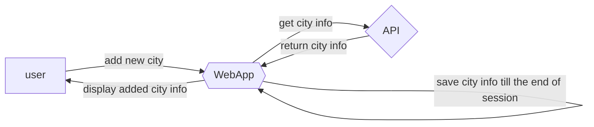

# Időjárás alkalmazás követelmény specifikáció

1. Jelenlegi státusz: Időjárás monitoring alkalmazás. Különböző városok időjárásának megfigyelésére alkalmas. Jelen és jövőbeli időjárás megfigyelése.

2. Vágyálom rendszer: Célunk ügyfelek kiszolgálása az időjárási infomációk szolgáltatásával.

3. Jelenlegi üzleti folyamatok:

3.1. App indítása: Aktuális tartózkodási hely időjárásának megjelenítése.

3.2. Új város hozzáadása: 

