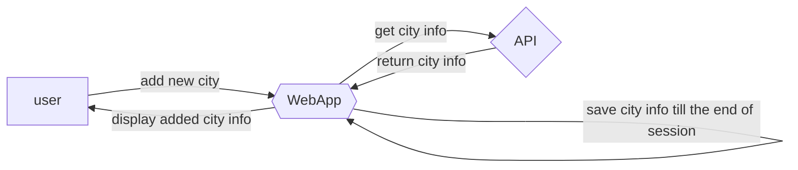

# Időjárás alkalmazás követelmény specifikáció

### Jelenlegi státusz:
Időjárás monitoring alkalmazás. Különböző városok időjárásának megfigyelésére alkalmas. Jelen és jövőbeli időjárás megfigyelése. Az időjárásmegjelenítés tartalmazza a hőmérséklet, szél és egyéb időjárással kapcsolatos státusz megosztását / megjelenítését

### Vágyálom rendszer:
Célunk ügyfeleink naprakész, percre pontos információk szerzése a jelenlegi időjárásról annak céljából, hogy ne érhessék meglepetések utazás, kirándulás esetében, hogy tudják, mikor hogyan kell öltözködniük és mit kell magukkal vinniük az utazásokra. Az alkalmazásnak könnyen üzemeltethetőnek kell lennie. Az online megjelenítésnek lehetőleg reszponzívnak kell lennie, hogy mobil / tablet illetve számítógép eszközökön is szépen, jól láthatóan megjelenített legyen. Elvárt a platformfüggetlenség, nem elfogadható, ha csak egy operációs rendszeren futtatható az alkalmazás.

3. Jelenlegi üzleti folyamatok:

3.1. App indítása: Aktuális tartózkodási hely időjárásának megjelenítése.

3.2. Új város hozzáadása: 

---