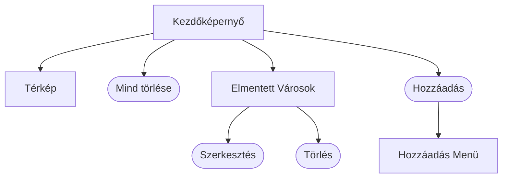

# Rendszerterv

A rendszer célja aktuális regionális időjárási adatok hozzáférésének biztosítása.
A felhasználónak lehetőséget ad bizonyos települések időjárási adatainak elmentésére.
Kizárólag PC-ről elérhető webes felület van tervben.

## A rendszer célja

## Projektterv

### Projekt szerepkörök

| Név       | Szerepkör | Feladat |
|-------------|-----------|---------|
| Gyenes Balázs | Programozó | N/A |
| Baráth Simon | Programozó | N/A |
| Brázda Martin | Programozó | N/A |
| Deák Erik   | Programozó | N/A |

### Ütemterv

## Üzleti folyamatok modellje

## Követelmények

## Funkcionális terv

### Menühierarchia

## Fizikai környezet

- Az alkalmazás kizárólag PC-ről használt webes felületre készül.
- Van tűzfal a hálózaton és minden portot engedélyez
- Nincs monetizált komponens
- Fejleszői eszközök:
  - Jetbrains Intellij IDEA
  - Paint.NET

## Implementációs terv

A webes felület HTML, CSS és JavaScript nyelveken fog elkészülni a [Weather API](https://openweathermap.org/api)-t felhasználva.
A rendszer fájlrendszere jelentősen szét lesz szórva az egyszerűbb kiegészítés és a könnyebb értelmezés végett. 

## Tesztterv

A tesztelések célja a rendszer és komponensei megfelelő működésének ellenőrzése, vizsgálata.

## Telepítési terv

- Android/IOS: nincs tervben
- Webes alkalmazás: Az alkalmazás megtekintéséhez szükséges **egy** az ajánlott böngészők közül:
Google Chrome, Mozilla Firefox, Opera 

