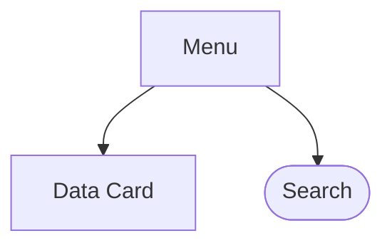

# Rendszerterv

A rendszer célja aktuális regionális időjárási adatok hozzáférésének biztosítása.
A felhasználónak lehetőséget ad bizonyos települések időjárási adatainak elmentésére.
Kizárólag PC-ről elérhető webes felület van tervben.

## A rendszer célja

## Projektterv

### Projekt szerepkörök

| Név       | Szerepkör | Feladat           |
|-------------|-----------|-------------------|
| Gyenes Balázs | Programozó | Frontend Controll |
| Baráth Simon | Programozó | N/A               |
| Brázda Martin | Programozó | Frontend Style    |
| Deák Erik   | Programozó | N/A               |

### Ütemterv

| Funkció | Feladat                        | Prioritás | Becslés (h) | Eltelt Idő (h) | Hátralévő idő (h) |
|---------|--------------------------------|-----------|-------------|----------------|-------------------|
|KövSpec|                                | 0         | 4           | 1              | 3                 |
|FunkSpec|                                | 0         | 4           | 1              | 3                 |
|Rendszerterv|                                | 0         | 4           | 1              | 3                 |
| WebApp | Felület stílus elkészítése     | 1         | 8           | 0              | 8                 |
| | Felület Controller Elkészítése | 2         | 6           | 0              | 6                 | 

## Üzleti folyamatok modellje

## Követelmények

## Funkcionális terv

### Menühierarchia

## Fizikai környezet

- Az alkalmazás kizárólag PC-ről használt webes felületre készül.
- Van tűzfal a hálózaton és minden portot engedélyez
- Nincs monetizált komponens
- Fejleszői eszközök:
  - Jetbrains Intellij IDEA
  - Paint.NET

## Implementációs terv

A webes felület HTML, CSS és JavaScript nyelveken fog elkészülni a [Weather API](https://openweathermap.org/api)-t felhasználva.
A rendszer fájlrendszere jelentősen szét lesz szórva az egyszerűbb kiegészítés és a könnyebb értelmezés végett. 

## Tesztterv

A tesztelések célja a rendszer és komponensei megfelelő működésének ellenőrzése, vizsgálata.

## Telepítési terv

- Android/IOS: nincs tervben
- Webes alkalmazás: Az alkalmazás megtekintéséhez szükséges **egy** az ajánlott böngészők közül:
Google Chrome, Mozilla Firefox, Opera 

